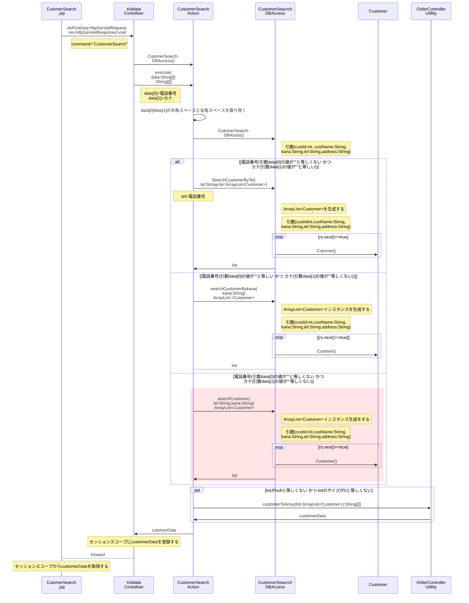

# シーケンス図 - UC01: 顧客情報を検索する

> **プロジェクト:** KES01001 注文受付業務改善プロジェクト
> **ソフトウェア:** KIDDA-LA業務システム
> **ユースケース:** UC01 顧客情報を検索する

```mermaid
sequenceDiagram
    %% =========== オブジェクト定義 ============
    participant JSP as CutomerSearch<br/>.jsp
    participant Ctrl as Kiddala<br/>Contolloer
    participant Action as CustomerSearch<br/>Action
    participant DB as CustomerSeacrch<br/>DBAccess
    participant Cust as Customer
    participant Util as OrderController<br/>Utillity

    %% =========== 基本フロー ============
    JSP->>Ctrl: doPost(req:HttpServletRequest,<br/>res:HttpServletResponse):void
    Note left of Ctrl: command="CustomerSearch"

    Ctrl->>Action: CutomerSearch-<br/>DBAccess()
    Ctrl->>Action: execute(<br/>data:String[])<br/>:String[][]

    Note right of Ctrl: data[0]=電話番号<br/>data[1]=カナ
    Action->>Action: data[0]data[1]の半角スペースと全角スペースを取り除く

    Action->>DB: CutomerSearch-<br/>DBAcess()
    Note right of DB: 引数(custId:int, custName:String,<br/>kana:String,tel:String,address:String)

    %% =========== alt: 条件分岐 ============
    alt [電話番号(引数data[0]の値が""と等しくない かつ カナ(引数data[1]の値が""と等しい))
        %% --- 条件1: 電話番号のみ ---
        Action->>DB: SearchCustomerByTel(<br/>tel:String<br/:ArrayList<Customer>)
        Note over Action: tel=電話番号

        note right of DB: ArrayList<Customer>を生成する
        Note right of DB: 引数(custIdint,custName:String,<br/>kana:String,tel:String,address:String)

        loop rs.next()==true
            DB->>Cust: Cutomer()
        end

        DB->>Action: list
    else [電話番号(引数data[0]の値が""と等しい かつ カナ(引数data[1]の値が""等しくない))] 
        %% --- 条件2: カナのみ ---
        Action->>DB: searchCustomerBykana(<br/>kana:String)<br/>ArrayList:<Customer>

        Note right of DB: ArrayList<Customer>インスタンスを生成する
        Note right of DB: 引数(custId:int,custName:String,<br/>kana:String,tel:String,address:String)

        loop [rs.next()==true]
            DB->>Cust: Custmer()
        end
        DB-->Action: list

    %% ↓↓↓ ここから作業①: 編集対象 ↓↓↓
    
    else 電話番号(引数data[0]の値が""と等しくない かつ カナ(引数data[1]の値が""等しくない)
    rect rgba(255, 0, 0, 0.1)
        %% --- 条件3: 電話番号とカナ両方等しくない　---
        Action->>DB: searchCustomer(<br/>tel:String,kana:String)<br/>:ArrayList<Customer>

        Note right of DB: ArrayList<Customer>インスタンス生成をする
        Note right of DB: 引数(custId:int,custName:String,<br/>kana:String,tel:String,address:String)
        loop rs.next()==true
            DB->>Cust: Customer()
        end

        DB->>Action: list
    end

     %% ↑↑↑ ここまで作業① ↑↑↑
    end

    opt listがnullと等しくない かつ listのサイズが0と等しくない
        Action->>Util: customerToArray(list:ArrayList<Customer>):String[][]
        Util->>Action: customerData
    end

    Action->>Ctrl: cutomerData
    Note over Ctrl: セッションスコープにcustomerDataを登録する

    Ctrl-->JSP: forward
    Note over JSP: セッションスコープからcustomerDataを取得する


```